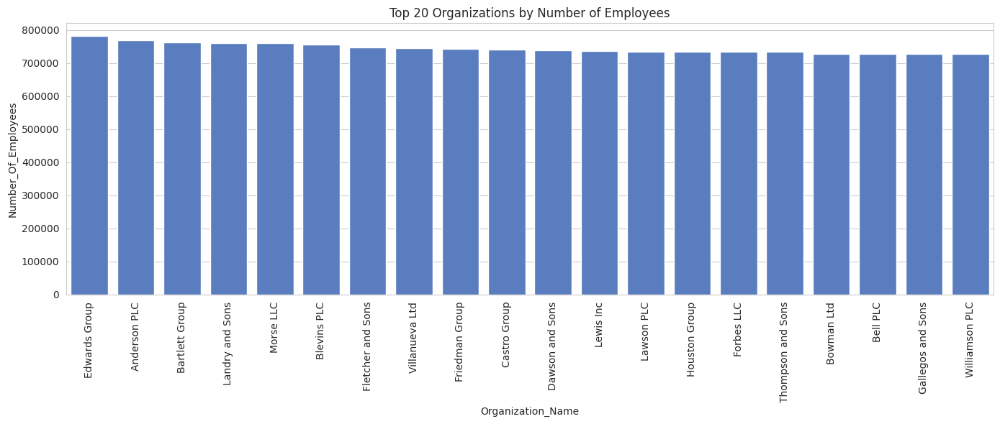

# 📊 Organization Data Analysis (200k+ Records)

This project explores and visualizes organizational data from a dataset with over **200,000 rows**. It includes metrics such as number of employees, number of offices, industry categories, country presence, website links, and founding years. The goal is to extract insights, process complex groupings, and generate professional plots using Python.

---
## 📁 Old Dataset
- [Old Dataset](https://drive.usercontent.google.com/download?id=18vlOi20KcMR328ewc2NBsoBNPrV3vL9Q&export=download&authuser=0)
## 📁 Managed & Analyzed Dataset Overview

- [Updated Dataset](https://drive.google.com/file/d/1t7ice3HDC5VUa5dpufo7xME3ECj2pSqM/view?usp=drivesdk)

Each record may include:

- `Name`
- `Number of Offices`
- `Number of Employees`
- `Countries` (list)
- `Industries` (list)
- `Websites` (list)
- `Year Founded`

---

## 🛠 Tools & Libraries Used

- [Python 3](https://www.python.org/)
- [Pandas](https://pandas.pydata.org/) – data cleaning & merging
- [Seaborn](https://seaborn.pydata.org/) – plotting & aesthetics
- [Matplotlib](https://matplotlib.org/) – chart rendering
- [collections.Counter](https://docs.python.org/3/library/collections.html#collections.Counter) – count top categories

---
## 📌 Project Features

- ✅ **Processes a large CSV file** with 200k+ organization records.
- 🔍 **Groups data by organization name** to extract top information:
  - Top 4 countries per organization
  - Top 4 industries per organization
  - Top 4 websites per organization
- 🧮 **Calculates key metrics**:
  - Total number of employees per organization
  - Average number of employees per office
  - Earliest year founded
- 🔗 **Merges all grouped and calculated data** into a final clean DataFrame.

### 📊 Graphs & Visualizations

Each of the following visual insights is generated using Seaborn and Matplotlib:

- 📦 **Top 20 Organizations by Employee Count**  
  _Bar chart of organizations with the most employees_

- 🏢 **Number of Offices per Organization**  
  _Bar chart of organizations with the most physical locations_

- 📉 **Scatter Plot – Employees vs Offices**  
  _Explores the relationship between office count and employee count_

- 📐 **Average Employees per Office**  
  _Bar chart to show organizational scale efficiency_

- 📊 **Histogram of Employee Distribution**  
  _Shows how employee numbers are spread out across all orgs_

- 🕰 **Count of Organizations by Year Founded**  
  _Bar chart showing startup/expansion trends by year_

- 🌍 **Top 10 Most Common Countries**  
  _Horizontal bar chart showing most frequent countries_

- 🏭 **Top 10 Most Common Industries**  
  _Horizontal bar chart showing most represented industries_

- 🥧 **Top 5 Countries – Pie Chart**  
  _Shows percentage distribution of top 5 countries_

- 📈 **Line Chart – Year Founded vs Average Employees**  
  _Trend of organization size over founding years_

- 🔄 **Pairplot of Numeric Metrics**  
  _Scatter matrix comparing offices, employees, and avg employees per org_

---

## 📈 Visualizations

### 1. Top 20 Organizations by Employees

### 2. Offices per Organization
.png)

### 3. Scatter: Employees vs Offices
.png)

### 4. Average Employees per Office
.png)

### 5. Employee Count Distribution
.png)

### 6. Organizations by Year Founded
.png)

---

## 📦 Final Data Columns (`new_df`)

| Column                | Description                            |
|-----------------------|----------------------------------------|
| `Organization_Name`   | Name of the organization               |
| `Number_of_Offices`   | Total number of offices                |
| `Country`             | Top 4 countries                        |
| `Number_Of_Employees` | Total number of employees              |
| `Average_No_Of_Employ`| Average employees per office           |
| `Year_Founded`        | Earliest year of founding              |
| `Industry`            | Top 4 industries                       |
| `Website`             | Top 4 websites                         |

> ✅ **Credits**  
> Data and insights are made by **Muhammad Sohaib**.  
> Thanks for visit.

**Contact sohaibkhansb9@gmail.com**
